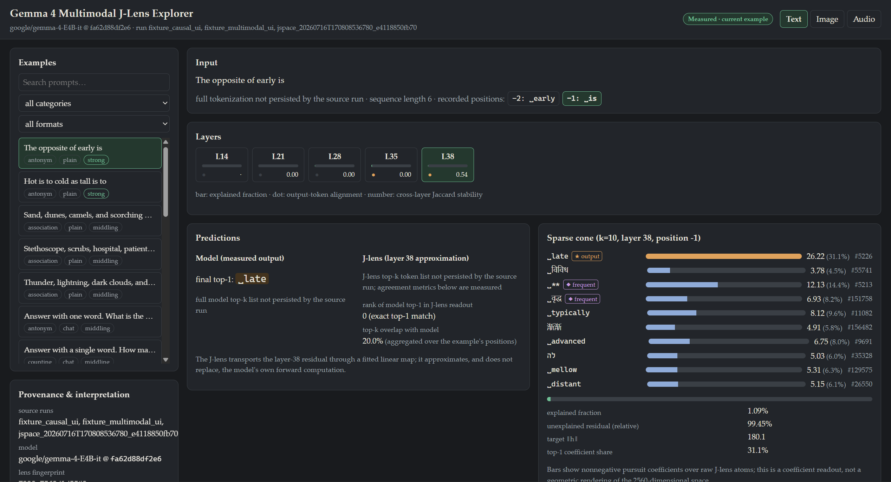
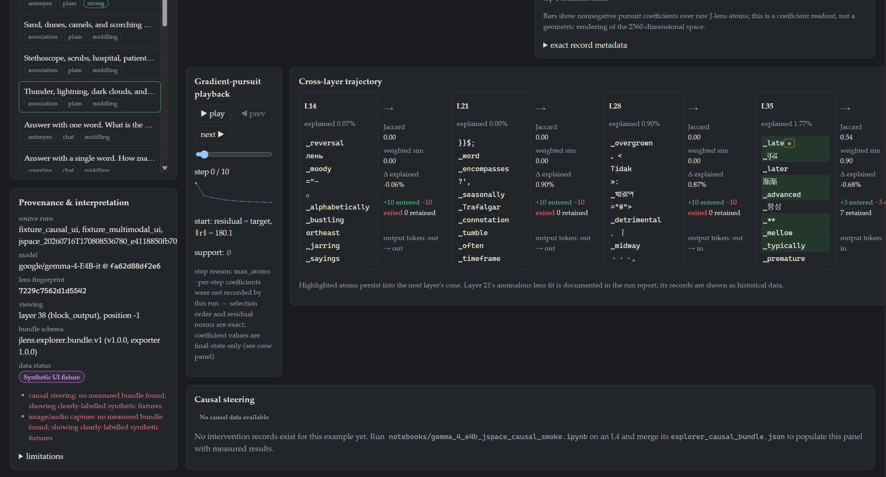
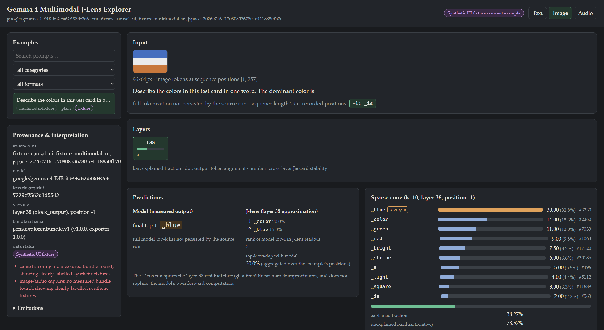
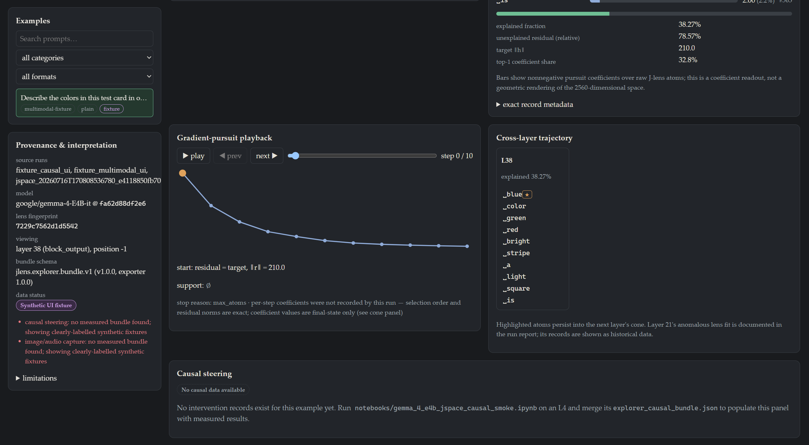
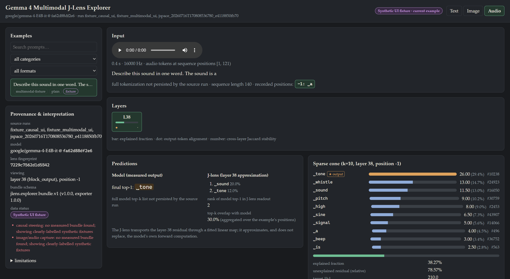
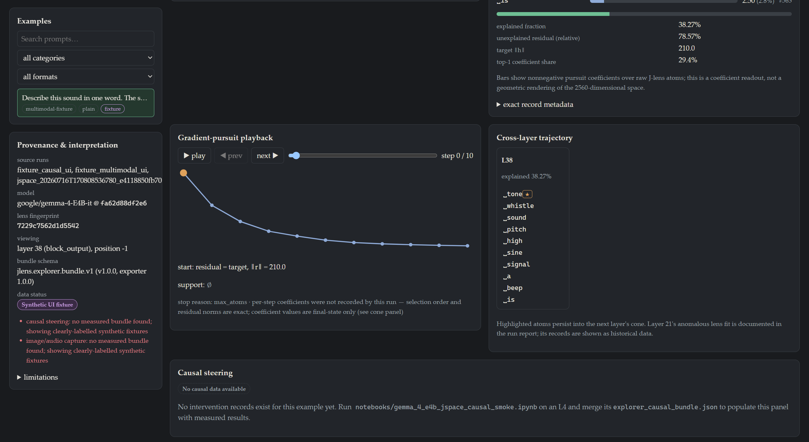
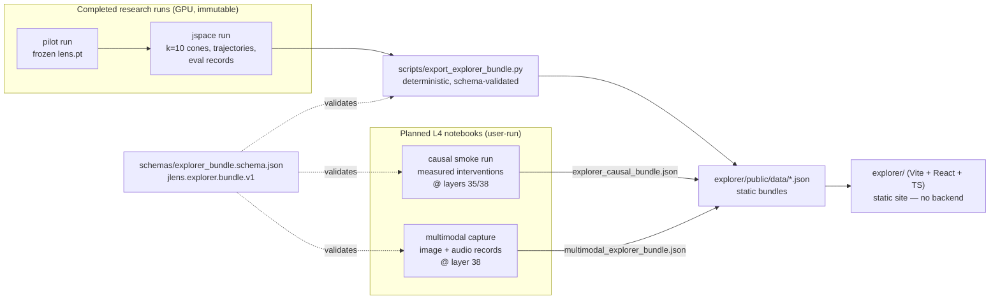

# Gemma 4 Multimodal J-Lens Explorer

A browser-based interpretability explorer for
[`google/gemma-4-E4B-it`](https://huggingface.co/google/gemma-4-E4B-it) that
visualizes **J-lens predictions**, **sparse k=10 gradient-pursuit cones**,
**cross-layer cone trajectories**, and **measured causal steering** for text,
image-conditioned, and audio-conditioned model states — built on this
repository's completed Jacobian-lens research runs. The explorer is a fully
static site: browsing completed experiments never loads Gemma and never runs
Python.

This repo is a research fork adapting Anthropic's official **Jacobian Lens**
reference implementation to Gemma 4 E4B.

- **Paper (authoritative method source):** [Verbalizable Representations Form a
  Global Workspace in Language Models](https://transformer-circuits.pub/2026/workspace/index.html)
  (Anthropic, 2026).
- **Upstream implementation:** [anthropics/jacobian-lens](https://github.com/anthropics/jacobian-lens),
  cloned with full history; git remote `upstream`; starting commit
  **`581d398613e5602a5af361e1c34d3a92ea82ba8e`** ("Initial release"). Upstream is a
  reference implementation, is not maintained, and is treated here as research
  scaffolding that is audited and tested rather than assumed correct.
- **License:** Apache-2.0 throughout ([LICENSE](LICENSE)). Upstream code
  retains Anthropic PBC copyright notices; files new in this fork are marked in
  their headers.

## Explorer

The browser application displays exported research artifacts rather than loading Gemma or running experiments in the browser.

### Text

The text view displays a comprehensive breakdown of a measured model state for a chosen prompt. It shows the prompt and recorded token position, the model prediction, and the J-lens approximation. You can use the layer selection to inspect the sparse cone at different depths, along with reconstruction diagnostics, provenance, and detailed gradient-pursuit information and cross-layer trajectories.

<p align="center">
  
</p>
*Text explorer overview: browsing measured records for a text prompt, comparing model vs J-lens predictions, and examining the k=10 sparse cone.*

<p align="center">
  
</p>
*Text explorer details: replaying the sparse gradient pursuit and tracing the cross-layer trajectory of retained atoms.*

### Image

The current image view demonstrates the multimodal UI scaffolding using a placeholder image and synthetic fixture data. It prepares the explorer for measured multimodal records; currently, the view is strictly fixture-backed until the capture notebook is run.

<p align="center">
  
</p>
*Image explorer overview showing the placeholder UI before a measured run completes.*

<p align="center">
  
</p>
*Image explorer details showing the synthetic UI fixtures for gradient pursuit and trajectories.*

### Audio

The current audio view demonstrates the multimodal UI scaffolding using a placeholder audio player and synthetic fixture data. It prepares the explorer for measured multimodal records; currently, the view is strictly fixture-backed until the capture notebook is run.

<p align="center">
  
</p>
*Audio explorer overview showing the placeholder UI before a measured run completes.*

<p align="center">
  
</p>
*Audio explorer details showing the synthetic UI fixtures for gradient pursuit and trajectories.*

## Current data status

| Area | Current status | What is shown |
|---|---|---|
| Text | Measured | Completed jspace run (20-example demo bundle) |
| Image | Fixture-backed | Synthetic UI fixture until multimodal capture notebook is run |
| Audio | Fixture-backed | Synthetic UI fixture until multimodal capture notebook is run |
| Causal interventions | Pending run | Synthetic UI fixture or missing data until causal smoke notebook is run |

## How the explorer fits into the research pipeline



At a logical level, the data pipeline flows as follows:

Prompt or multimodal input
→ Gemma activations
→ fitted J-lens transport
→ J-space dictionary
→ nonnegative sparse pursuit
→ cone and trajectory records
→ deterministic JSON export
→ static React explorer

The explorer is a visualization layer; it does not recompute the model, nor does it replace Gemma's forward computation. Token-readable atoms are interpretability readouts, not automatically proven semantic concepts. Causal claims require measured interventions and controls.

The frontend automatically prefers measured bundles: files placed under `explorer/public/data/measured/` (git-ignored) silently replace the fixtures.

## Explorer: install, develop, build

Requires Node.js ≥ 20.

```bash
cd explorer
npm install
npm run dev        # dev server at http://localhost:5173
npm test           # Vitest + React Testing Library (24 tests)
npm run build      # type-check + static production build into explorer/dist/
```

`explorer/dist/` is deployable to any static host (GitHub Pages included —
`base: "./"` keeps asset paths relative). No server-side code exists.

### Exporting completed runs

```bash
# Rebuild the committed 20-example text demo bundle (byte-identical re-runs):
python scripts/export_explorer_bundle.py \
    --run-dir runs/jspace_20260716T170808536780_e4118850fb70 \
    --analysis-dir reports/jspace_20260716T170808536780_e4118850fb70 \
    --demo-set --out explorer/public/data/text_demo.json

# Merge later measured bundles into a combined export if desired:
python scripts/export_explorer_bundle.py --run-dir <jspace-run> --demo-set \
    --merge path/to/explorer_causal_bundle.json \
    --merge path/to/multimodal_explorer_bundle.json \
    --out explorer/public/data/text_demo.json
```

The bundle format is versioned and documented:
[docs/explorer_data_format.md](docs/explorer_data_format.md); architecture:
[docs/explorer_architecture.md](docs/explorer_architecture.md); product scope:
[docs/explorer_mvp_spec.md](docs/explorer_mvp_spec.md).

### Running the causal smoke notebook (Colab L4)

`notebooks/gemma_4_e4b_jspace_causal_smoke.ipynb` — measured residual-stream
interventions (`h' = h + multiplier·delta`) at layers 35/38 on four
manifest-pinned examples, with a baseline-parity gate, deterministic condition
IDs, per-condition checkpointing, and norm-matched random controls
(~120 conditions, ≈30–45 min). Guide: [docs/causal_smoke_run.md](docs/causal_smoke_run.md).
Afterwards copy `artifacts/explorer_causal_bundle.json` to
`explorer/public/data/measured/causal.json`.

### Running the multimodal capture notebook (Colab L4)

`notebooks/gemma_4_e4b_multimodal_jlens_capture.ipynb` — the first
image-conditioned and audio-conditioned records: one user-supplied image and
audio clip, layer 38, k=10 pursuit on the frozen text-fitted lens
(≈15–25 min). Guide: [docs/multimodal_capture.md](docs/multimodal_capture.md).
Afterwards copy `artifacts/multimodal_explorer_bundle.json` to
`explorer/public/data/measured/multimodal.json` and `artifacts/assets/*` to
`explorer/public/data/measured/assets/`.

### Explorer limitations

- The J-lens is a linear approximation fitted on 100 text prompts; the k=10
  cones explain a small fraction of activation norm (shown, not hidden).
- Per-step pursuit coefficients and per-layer J-lens top-k lists were not
  persisted by the completed text run; the UI labels them unavailable rather
  than fabricating them (capture notebooks record full lists for new runs).
- Multimodal records apply the *text-fitted* lens to multimodal-conditioned
  decoder states — exploratory, with no modality-invariance claim and no
  pixel/audio-span attribution.
- Causal effects are shown only at measured multipliers; nothing is
  interpolated. Cone signatures are bookkeeping, not concept claims.
- Layer 21's anomalous lens fit is documented history
  ([docs/jspace_run_report.md](docs/jspace_run_report.md)), visible in the
  explorer as data, and not an active workstream.

## Research status

The **pilot** stage — the final planned fitting stage (micro-smoke → smoke →
**pilot**) — has completed on real `google/gemma-4-E4B-it` weights (revision
`fa62d88df2e6df5efa9d26ad6b3beaea2765f0cd`): the Jacobian lens was fitted on
100 WikiText prompts at 7 source layers (3, 7, 14, 21, 28, 35, 38) in
9665 s on a Colab L4, producing finite Jacobians, and was evaluated against
a logit-lens baseline and three negative controls. Layer 38 gave the
strongest next-token rank (12) and layers 28/35/38 strongly beat the
permuted and random controls; the single wrong-layer control proved
ambiguous and is audited and superseded for future evaluations. Full
results and interpretation boundaries: **[docs/pilot_report.md](docs/pilot_report.md)**;
run metadata is preserved under
[`runs/pilot_20260715T200437612150_311fd108c23a/`](runs/pilot_20260715T200437612150_311fd108c23a/).
The earlier smoke stage is documented in
[docs/smoke_report.md](docs/smoke_report.md); engineering milestones in
[docs/research_log.md](docs/research_log.md).

The sparse **J-space decomposition** by gradient pursuit on the frozen
pilot lens (branch `jspace-gradient-pursuit`; method in
[docs/jspace_decomposition.md](docs/jspace_decomposition.md)) has completed
on real weights: 1,140 decompositions (5 layers × k ∈ {10, 16, 25} × 76
held-out activations) under
[`runs/jspace_20260716T170808536780_e4118850fb70/`](runs/jspace_20260716T170808536780_e4118850fb70/).
The full offline analysis — k comparison, cross-k stability, the layer-21
collapse, the plain/chat gap, similarity-based recurrence, atom
frequencies, candidate-ignition robustness, and evaluation controls — is in
**[docs/jspace_run_report.md](docs/jspace_run_report.md)** (methodology:
[docs/jspace_similarity_analysis.md](docs/jspace_similarity_analysis.md);
derived tables under `reports/`, regenerable with
`python scripts/analyze_jspace.py --run-dir <run>`).

The **explorer product** (branch `multimodal-jlens-explorer`) packages those
completed text results into the static browser application above and prepares
the causal-steering and multimodal-capture notebooks for the next real runs.
No causal or multimodal measurements exist yet; the UI says so explicitly
until the runs complete.

## What is inherited vs new

**Inherited unchanged** (upstream `jlens` core — no modifications):
`jlens/protocol.py`, `jlens/hf.py`, `jlens/hooks.py`, `jlens/fitting.py`
(estimator, checkpointing, merging), `jlens/lens.py` (save/load/apply,
logit-lens baseline), `jlens/vis.py`, `jlens/examples.py`, all 32 upstream
tests, and the upstream walkthrough/README (below).

**New in this fork:**

| Path | Purpose |
|---|---|
| `jlens/gemma4.py` | Revision pinning, gated loading, explicit BOS control, pre-softcap + softcapped dual readout, architecture verification, fit-cost probe |
| `jlens/controls.py` | Negative controls: row-permuted fitted J (primary), scale-matched random, legacy wrong-layer application, and named layer-mapping controls (adjacent / distant / shuffled) with recorded provenance; overlap/rank metrics |
| `jlens/metadata.py` | Config validation (fit + jspace + causal + multimodal schemas), config/file fingerprints, environment manifest, atomic metadata writes |
| `jlens/evaluation.py` | Named control suite, one-forward-pass evaluation, aggregate statistics (median rank, MRR, hit rates) per format/category |
| `jlens/pursuit.py` | Sparse nonnegative J-space decomposition by gradient pursuit; J-lens dictionary construction (rows of `W_U J_l`); see [docs/jspace_decomposition.md](docs/jspace_decomposition.md) |
| `jlens/cones.py` | Cone record schema, deterministic cone signatures, trajectory/overlap/concentration utilities, transparent grouping |
| `jlens/ignition.py` | Candidate-ignition diagnostics (explicitly labeled; optional heuristic composite disabled by default) |
| `jlens/similarity.py` | Similarity-based recurrence (Jaccard / weighted Jaccard / sparse cosine / top-m), stratified similarity groups with threshold-sensitivity, atom frequency and enrichment statistics |
| `jlens/jspace_analysis.py`, `scripts/analyze_jspace.py` | Deterministic read-only analysis of a completed jspace run: integrity checks, k comparison, cross-k stability, transition/eval summaries (outputs under `reports/`) |
| `jlens/explorer_export.py`, `scripts/export_explorer_bundle.py` | Deterministic explorer-bundle exporter: normalized schema, stable IDs, absolute-path stripping, subset export, causal/multimodal merging |
| `jlens/interventions.py` | Residual-stream interventions at block_output sites: hook editing with exact position/dtype/tuple preservation, parity checks, deterministic condition IDs, norm-matched random controls, append-safe JSONL records |
| `schemas/explorer_bundle.schema.json` | Versioned JSON Schema for `jlens.explorer.bundle.v1` (text + image + audio + causal records) |
| `explorer/` | The Gemma 4 Multimodal J-Lens Explorer (Vite + React + TypeScript static app, Vitest tests) |
| `scripts/make_ui_fixtures.py` | Deterministic, loudly-labelled synthetic UI fixtures (causal + multimodal) for pre-run UI states |
| `configs/gemma_text_{microsmoke,smoke,pilot}.yaml`, `configs/gemma_jspace_pursuit.yaml` | The three fitting stages + the decomposition workflow |
| `configs/gemma_jspace_causal_smoke.yaml`, `configs/causal_smoke_examples.json` | Causal smoke-run config + deterministic 4-example manifest with per-example selection reasons |
| `configs/gemma_multimodal_jlens_capture.yaml` | Multimodal capture config (layer 38, k=10, user-supplied assets) |
| `configs/prompts/` | Plain-text fitting corpus (smoke), v1 evaluation prompts, categorized held-out evaluation set v2 |
| `scripts/fit_gemma.py`, `scripts/apply_gemma.py` | CLI: fit and evaluate with full metadata |
| `notebooks/gemma_4_e4b_text_jlens.ipynb` | End-to-end fitting notebook (produced the smoke and pilot runs) |
| `notebooks/gemma_4_e4b_jspace_pursuit.ipynb` | Decomposition notebook: verifies and consumes the frozen pilot lens, never refits |
| `notebooks/gemma_4_e4b_layer21_diagnostic.ipynb` | Layer-21 refit diagnostic (completed investigation; documented history) |
| `notebooks/gemma_4_e4b_jspace_causal_smoke.ipynb` | Causal steering smoke run: parity-gated, checkpointed, resume-safe measured interventions |
| `notebooks/gemma_4_e4b_multimodal_jlens_capture.ipynb` | First image/audio-conditioned captures on the frozen lens |
| `tests/` | CPU-only tests (no network, no real model): adapter, controls, evaluation, pursuit, cones, ignition, metadata, scripts, exporter, interventions, notebook light paths, finite differences |

## Gemma 4 E4B specifics

`Gemma4ForConditionalGeneration` (multimodal wrapper; the vision/audio towers
are loaded but never executed for text-only work): text decoder
`model.language_model` with **42 blocks, d_model 2560, vocab 262144**, dense
(`enable_moe_block: false`), tied unembedding, `final_logit_softcapping=30.0`,
per-layer embeddings (PLE) folded inside each block, sliding-window 512 with
every-6th-layer full attention, KV sharing across the last 18 layers.

- **Source site** `h_l`: output of `model.language_model.layers[l]` (after
  attention + MLP + PLE re-injection + `layer_scalar`) — the input to block `l+1`.
  This is also the exact site `jlens/interventions.py` edits.
- **Target site** `h_final`: same site at block 41 (pre-final-norm residual).
- **Convention:** `J[i, j] = ∂h_final[i]/∂h_l[j]` (rows = target dims);
  transport is `J @ h`. Readout reports **pre-softcap** logits (paper
  convention) and **softcapped** logits (Gemma's real output pathway);
  the cap is monotonic so rankings are identical.
- The model repo revision is resolved to an immutable commit SHA at run time
  and recorded in every artifact; nothing is fitted against a mutable ref.

## Install & test (Python)

```bash
pip install -e .            # torch, transformers>=5.5, huggingface_hub, numpy
pip install -e .[dev]       # + pytest, ruff, datasets, pyyaml (jsonschema recommended)
pytest tests -q             # CPU-only tests; no network, no model download
```

Model access: `google/gemma-4-E4B-it` (~16 GB bf16) is ungated on the HF Hub
but subject to the Gemma license; downloads happen only under the explicit
flag below.

## Running the experiment stages

Real-model work is intended for Colab GPUs (the completed fits used an
A100/L4; the new causal and multimodal notebooks are sized for an **L4**).
The model does not fit a 12 GB local GPU, and CPU fitting is impractically
slow. Start every new environment with the memory probe at the configured
small `dim_batch` (4–8) and scale up only after reading its peak-memory
figure.

```bash
# stage 1: micro-smoke — 1–2 prompts, one middle layer (21), seq ≤ 48, dim_batch 4
python scripts/fit_gemma.py --config configs/gemma_text_microsmoke.yaml \
    --allow-model-load --device-map cuda

# stage 2: smoke — 8 plain-text prompts, layers [7,14,21,28,35]
python scripts/fit_gemma.py --config configs/gemma_text_smoke.yaml \
    --allow-model-load --device-map cuda
python scripts/apply_gemma.py --config configs/gemma_text_smoke.yaml \
    --lens artifacts/smoke/lens.pt --allow-model-load --device-map cuda

# stage 3: pilot — 100 WikiText-103 sequences, layers [3,7,14,21,28,35,38]
python scripts/fit_gemma.py --config configs/gemma_text_pilot.yaml \
    --allow-model-load --device-map cuda
```

Or run `notebooks/gemma_4_e4b_text_jlens.ipynb` top-to-bottom
(`JLENS_MODE=microsmoke|smoke|pilot`, `JLENS_ALLOW_GEMMA=1`,
`JLENS_DEVICE_MAP=cuda`).

Artifacts land in `artifacts/<mode>/` (git-ignored): `lens.pt`, `ckpt.pt`,
`fit_metadata.json`, `apply_results.json`, `apply_summary.md`, optional slice
HTML. Every artifact embeds the config fingerprint, model revision, upstream
and local commits, prompt hashes, seeds, versions, runtime, and peak memory.
Smoke-stage corpora are far below the paper's ~1000 sequences: smoke-mode
readouts verify plumbing, not lens quality.

**Known limitations:** bf16 backward noise in the fp32-accumulated `J`;
sliding-window + KV-shared attention differ architecturally from the paper's
models; the `-it` chat distribution differs from the plain-text fitting corpus
(chat prompts are evaluated separately, never fitted on); multimodal support
is limited to the exploratory capture notebook — the lens itself remains
text-fitted.

---

# Upstream README — jlens — Jacobian lens

> **Reference implementation.** Not maintained and not accepting contributions.

Companion code for [**Verbalizable Representations Form a Global Workspace in
Language Models**](https://transformer-circuits.pub/2026/workspace/index.html).

The Jacobian lens reads out what an internal activation is disposed to make the
model say. It linearly transports a residual-stream vector at any layer and
position into the final-layer basis, then decodes it with the model's own
unembedding into a ranked list of vocabulary tokens.

The transport is the average input–output Jacobian over a text corpus:

```
lens_l(h) = unembed( J_l @ h ), J_l = E[∂h_final / ∂h_l]
```

The expectation is over prompts, source positions, and all current-and-future
target positions in a generic web-text corpus; the precise estimator
(cotangents summed over target positions, then averaged over source positions)
is documented in the [`jlens.fitting`](jlens/fitting.py) module docstring.

This repo fits the lens on open-weights decoder transformers, applies it, and
renders the interactive layer × position view shown below. Examples use Qwen;
other HuggingFace decoders adapt cleanly.


*The ASCII-face example: selecting the `^` (nose) position shows the lens
reading out "nose" at mid layers, although the word never appears in the
prompt.*

## Install

```bash
pip install -e .
```

## Usage

### Apply

To apply a pre-fitted lens:

```python
import transformers, jlens

hf = transformers.AutoModelForCausalLM.from_pretrained("org/model").cuda()
tok = transformers.AutoTokenizer.from_pretrained("org/model")
model = jlens.from_hf(hf, tok)

lens = jlens.JacobianLens.from_pretrained("org/lens-repo", filename="model/lens.pt")
lens_logits, model_logits, _ = lens.apply(
    model, "Fact: The currency used in the country shaped like a boot is",
    positions=[-2])
for layer, logits in sorted(lens_logits.items()):
    print(layer, [tok.decode([t]) for t in logits[0].topk(5).indices])
```

### Fit

To fit a lens on your own model:

```python
lens = jlens.fit(model, prompts=my_prompts, checkpoint_path="out/ckpt.pt")
lens.save("out/jacobian_lens.pt")
```

The paper's lenses use 1000 sequences of 128 tokens from a pretraining-like
corpus. Quality saturates quickly (§9.3); ~100 prompts is usable. This is a
reference implementation and is not optimized; fitting time is dominated by
the model's own backward pass. Parallelize by running `fit()` on disjoint
slices and combining with `JacobianLens.merge()`.

## Walkthrough

[`walkthrough.ipynb`](walkthrough.ipynb) is the end-to-end notebook: load a
model, load (or fit) a lens, apply it at a few layers, and render a slice page
like the one above.

Reading a slice page:

- Each cell shows the lens top-1 word at that (position, layer); the
  superscript is its rank over the full vocabulary.
- Click a cell to select a (position, layer) and pin its top-1 token; pinned
  tokens get rank-tracking charts and a rank heatmap.
- The bottom row (`L = n_layers − 1`) is the model's actual output.

## License and data

Code is released under the Apache License 2.0 — see [LICENSE](LICENSE).

The replication and lens-eval prompt sets in [`data/`](data/) are synthetic,
authored by Anthropic, and released under the same Apache License 2.0 as the
code. See the READMEs in [`data/experiments/`](data/experiments/) and
[`data/evaluations/`](data/evaluations/) for what each set contains.

The slice-vis pages use [d3](https://github.com/d3/d3) (ISC license), loaded
from the jsDelivr CDN with subresource integrity or inlined into
self-contained pages.

No model weights or text corpora are bundled; models and datasets downloaded
at run time are subject to their own licenses.
