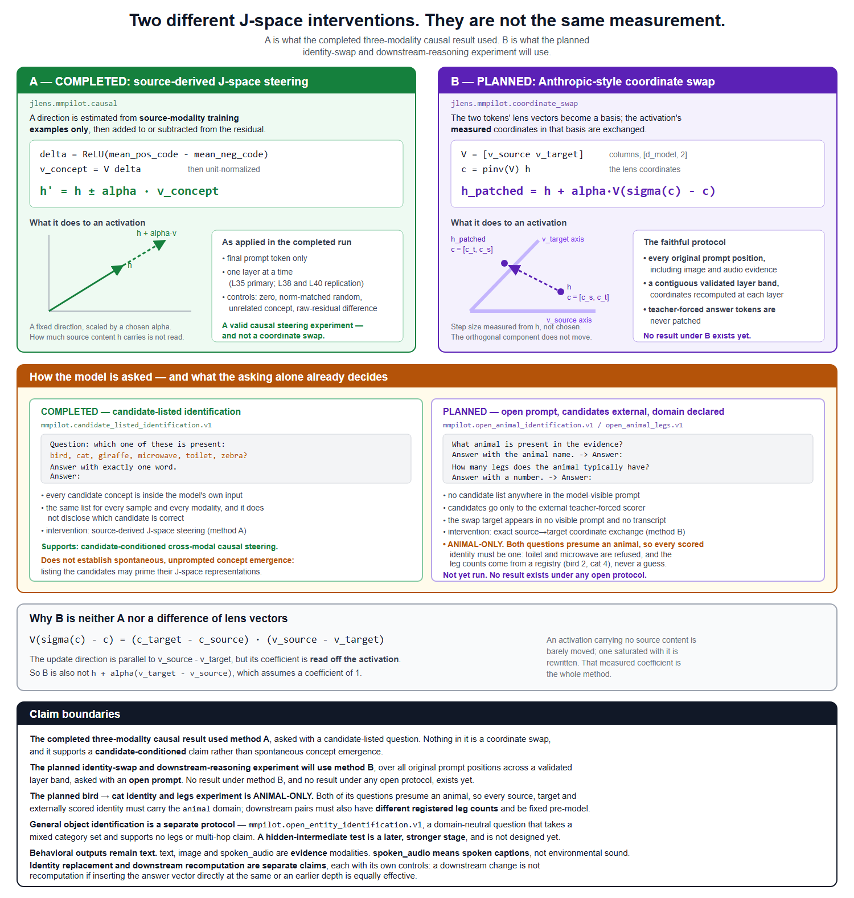

# The prompt protocol — what the model sees, and what only the scorer sees

**Status: implemented and MOCK-validated. No real open-prompt run exists.** This
document records the audit the module was built from, specifies the five
protocols, and states what each one is allowed to support.



Implementation: [`jlens/mmpilot/prompt_protocol.py`](../jlens/mmpilot/prompt_protocol.py).
MOCK: [`notebooks/open_prompt_protocol_mock_colab.ipynb`](../notebooks/open_prompt_protocol_mock_colab.ipynb).
Primary source: <https://transformer-circuits.pub/2026/workspace/index.html>.

---

## 1. The problem, stated precisely

The completed three-modality causal study asked its behavioral question by
listing every candidate in the prompt:

```
Question: which one of these is present: bird, cat, giraffe, microwave,
toilet, zebra? Answer with exactly one word.
Answer:
```

Complete candidate sequences were then scored by teacher-forced conditional log
likelihood, and the identical list was shared across every sample and every
modality. It did not disclose which candidate was correct.

**That experiment remains valid, and nothing about it is being retracted.** It
is a candidate-conditioned cross-modal causal steering result.

What it is not is the strongest form of the intervention. Listing every
candidate introduces all of them into the prompt and may prime their J-space
representations. Two things that are sometimes offered as answers to this are
not:

- **Source-derived positive-minus-negative estimation** subtracts components
  shared by the positive and negative prompts to first order. It removes the
  shared *prompt*, not the semantic priming of a candidate that then appears in
  the evidence-carrying half.
- **Candidate-order invariance** — scoring under the canonical and reversed
  option orders and requiring an order-stable decision — controls *ordering*
  bias. It says nothing about whether naming a concept primed it.

Anthropic's strongest Global Workspace interventions do not list candidates.
The internal-reasoning example, *"The number of legs on the animal that spins
webs is ..."*, never writes `spider` and never writes `ant`; the swap moved the
answer from 8 toward 6 with the intermediate unspoken. The flexible-
generalization example, *"The capital of France is ..."*, contains the source
but not the swap target.

---

## 2. Required audit, resolved from code

Every answer below was read out of the repository, not assumed.

| # | Question | Answer | Evidence |
|---|---|---|---|
| 1 | Where is the capability question constructed? | `DEFAULT_QUESTION`, `build_question()` (candidates joined in sorted order), `build_ordered_questions()` (canonical + reversed) and `build_prompt()` (prefixes `Caption: ` for `text`; image and spoken audio carry the question alone). | `jlens/mmpilot/capability.py:29-63` |
| 2 | Which stages receive the candidate-listed question? | **All of them.** `stage_capability` builds both option orders; `stage_activations` and `stage_causal` each call `build_question()` and pass the result to `_build_inputs_for()`. So the captured residuals, the J-space codes, the estimated directions and every intervention forward pass were all produced under a prompt naming every candidate. | `jlens/mmpilot/pipeline.py:344, 419, 789, 263-318` |
| 3 | Are candidate names incorporated before prompt hashing? | **Yes.** `prompt_hash = text_hash(prompt)` is taken over the fully rendered prompt, so it depends on the candidate set *and its order*. `balanced_capability_record` then hashes the join of both order hashes. | `jlens/mmpilot/backend.py:322, 373`; `capability.py:244-247` |
| 4 | How is `prompt_len` recorded relative to the candidates? | `BuiltInputs.prompt_len = input_ids.shape[1]` at build time — **before** any candidate token exists. It is the boundary every later stage uses, and the final prompt position is `prompt_len - 1`. | `jlens/mmpilot/backend.py:318-326, 88-91` |
| 5 | Which tensors are extended during complete-sequence scoring? | `input_ids` always; `attention_mask`, `token_type_ids`, `mm_token_type_ids` and `position_ids` only when they are 2-D with exactly `prompt_len` columns. Media tensors (`pixel_values`, `input_features`, their masks) are indexed by pixels or audio frames and pass through untouched — a media mask that coincidentally has `prompt_len` columns is excluded by name. | `jlens/mmpilot/capability.py:83-125` |
| 6 | Can intervention hooks reach candidate tokens? | **No, in both families.** The steering path edits the single fixed position `inputs.final_prompt_position = prompt_len - 1`. The coordinate-swap path resolves positions through `resolve_positions()`, which caps every rule at `prompt_len` and records `n_candidate_positions_skipped` on each forward pass. | `jlens/mmpilot/causal.py:219-223`; `coordinate_swap.py` `PROMPT_BOUNDARY_RULE`, `resolve_positions` |
| 7 | What must remain untouched for completed-run compatibility? | `DEFAULT_QUESTION`'s bytes; `PROMPT_PROTOCOL_VERSION = "gemma-it-chat-balanced-options-v1"`; the sorted-then-reversed option ordering and its recorded name `canonical_and_reversed_sorted_options.v1`; every key of `scientific_fingerprint`; `RunFingerprint`'s fields and digest algorithm; `CLAIM_ADMISSIBILITY_RULE_VERSION` and the payload `admissibility_rule_record` checksums (amended artifacts are bound to it). **None of them is changed by this work**, and `tests/test_mmpilot_prompt_protocol.py` pins the first four plus a legacy fingerprint digest. | `capability.py:33`; `pipeline.py:211-213`; `store.py:79-116`; `admissibility.py:52, 417-463` |
| 8 | Do any completed reports overstate the prompt as candidate-free? | **No.** The completed reports and `docs/multimodal_jspace_pilot.md` describe the capability gate as *"Same question and candidates in every modality"*, which is accurate. What was missing was not a false statement but a **stated limitation**, and §6 below is that statement. No completed artifact was edited. | — |

---

## 3. The five protocols, and the domain each presumes

| identifier | task domain | property | candidates in prompt | source may appear | target may appear | supports |
|---|---|---|---|---|---|---|
| `mmpilot.candidate_listed_identification.v1` | — | — | yes (legacy) | yes | yes | candidate-conditioned identification |
| `mmpilot.open_animal_identification.v1` | `animal` | — | no | yes, in natural evidence, **recorded** | never | open cross-modal **animal** identification |
| `mmpilot.open_entity_identification.v1` | `entity` | — | no | yes, recorded | never | open cross-modal **entity** identification |
| `mmpilot.open_animal_legs.v1` | `animal` | `animal_leg_count.v1` | no | yes, recorded | never | leg-count recomputation, with controls |
| `mmpilot.hidden_animal_legs.v1` | `animal` | `animal_leg_count.v1` | no | never | never | multi-hop reasoning, with controls |

### Why the domain is part of the protocol

*"What animal is present in the evidence?"* presumes the answer is an animal.
The pilot's six-concept set is `bird`, `cat`, `giraffe`, `microwave`, `toilet`,
`zebra` — two of which are not. Scoring that set against that question would not
be an open-identification test: it would measure what the model says when asked
for an animal that is not there, which is a different experiment with a
different interpretation. So an `animal`-domain protocol holds **every** source,
target and externally scored identity to that domain, and an **unspecified**
domain is a refusal rather than an assumption.

A mixed category set belongs to `open_entity_identification`, whose question
presumes nothing — and which in exchange supports **no** legs claim and **no**
multi-hop claim, automatically or otherwise.

"How many legs" is animal-specific for the same reason, and needs more: a
**unique registered leg count** for both source and target. Unregistered and
ambiguous are both refusals, because a count guessed at scoring time would
silently decide the experiment's ground truth.

**An open prompt is not hidden-intermediate reasoning merely because the
candidate list is absent.** `open_animal_identification` still permits the
source in written evidence; `hidden_animal_legs` does not, because there would
then be no intermediate left to be hidden.

### Retired identifiers

Three names this module used briefly are refused, with their replacement named:

| retired | replacement | why |
|---|---|---|
| `mmpilot.open_identification.v1` | `mmpilot.open_animal_identification.v1` | domain-blind name on an animal question |
| `mmpilot.open_downstream_property.v1` | `mmpilot.open_animal_legs.v1` | "downstream property" implies a generality "how many legs" does not have |
| `mmpilot.hidden_intermediate.v1` | `mmpilot.hidden_animal_legs.v1` | same |

No run was ever recorded under any of them — they were MOCK-only — so they are
**renamed rather than deprecated**.

### The model-visible prompts

`open_animal_identification` — identical bytes in every evidence channel:

```
What animal is present in the evidence? Answer with the animal name.
Answer:
```

`open_entity_identification` — domain-neutral, presumes no category:

```
What is present in the evidence? Answer with its name.
Answer:
```

`open_animal_legs` and `hidden_animal_legs`:

```
How many legs does the animal typically have? Answer with a number.
Answer:
```

The `text` condition prefixes its written evidence as `Evidence: {caption}\n`.
The `image` and `spoken_audio` conditions carry **only** the question — the
media is the evidence.

### What is model-visible, per modality

| modality | model-visible | audit-only |
|---|---|---|
| `text` | the written caption and the question | media reference |
| `image` | the image and the question | media reference, media checksum |
| `spoken_audio` | the waveform and the question | **the transcript**, media reference, media checksum |

The spoken transcript is read by the offline leakage audit and by nothing else.
`backend_input_kwargs()` is the single crossing point into the model and checks
it: the transcript is passed *in* only so the function can prove it is absent
from every argument going out. `BuiltPrompt.to_dict()` records the transcript as
a hash, never as text.

For `text`, a caption naming the source concept is legitimate evidence. It is
**recorded** (`source_in_visible_evidence`), not hidden and not removed.

---

## 4. The external scoring boundary

The question and the scored candidates are separate objects. Concretely:

1. Candidate strings are never interpolated into the prompt. For every open
   protocol the builder additionally refuses a question that contains one.
2. Each candidate's **complete** token sequence is appended only for scoring, by
   the existing `score_candidate_sequences()` — unchanged, and the same function
   the clean and patched runs both go through.
3. `prompt_len` is fixed when the input is built, before any candidate token
   exists, and `score_candidate_sequences` raises rather than scoring if the
   logits length does not equal `prompt_len + len(candidate)`.
4. Intervention hooks cannot modify candidate-completion positions — see audit
   row 6. `tests/test_mmpilot_prompt_protocol.py` asserts both the hook's own
   record and byte-identical candidate-tail activations under an active swap.
5. Reversing the candidate order leaves each candidate's own score unchanged
   (checked to `1e-9`), and leaves the prompt tokens identical.
6. Multi-token candidates are scored completely; the MOCK's candidates are
   two-token on purpose so prefix scoring cannot pass for sequence scoring.
7. **The prompt hash is independent of candidate enumeration order** — the
   candidates are not in the prompt. **The fingerprint is not independent of the
   candidate set**: `prompt_protocol_fingerprint` binds the sorted candidate
   strings and their token ids, so changing the set changes the digest while
   reordering it does not.

---

## 5. The leakage audit

Deterministic, versioned `jlens.mmpilot.prompt_leakage_audit.v1`. Normalization
is NFKC → casefold → NFKC, combining marks stripped, underscores and every
non-word character mapped to a space, whitespace collapsed. Matching is
**whole-token**, so `cat` does not match `concatenate`; morphological variants
must be registered as aliases.

Eight categories, and a per-protocol policy of `refuse` or `record`:

| category | candidate-listed | open identification<br>(`animal` and `entity`) | `open_animal_legs` | `hidden_animal_legs` |
|---|---|---|---|---|
| `instruction_candidate_leakage` | record | refuse | refuse | refuse |
| `candidate_enumeration_detected` | record | refuse | refuse | refuse |
| `source_in_visible_evidence` | record | **record** | record | refuse |
| `target_in_visible_evidence` | record | refuse | refuse | refuse |
| `source_in_audio_transcript` | record | record | record | refuse |
| `target_in_audio_transcript` | record | refuse | refuse | refuse |
| `property_answer_in_prompt` | record | n/a | refuse | refuse |
| `semantic_filename_exposure` | refuse | refuse | refuse | refuse |

Notes:

- A `spoken_audio` condition with **no transcript** is `unauditable`, and that
  fails any protocol whose policy refuses transcript leakage. An unchecked
  transcript is not a clean one.
- Under `open_animal_legs` the *source's* own property answer is
  permitted and recorded — a bird caption may say "standing on two legs" — while
  the target answer and every other answer choice are refused. Under
  `hidden_animal_legs` the source answer is refused too, because it trivially
  reveals the intermediate.
- A refusal is a refusal. The protocol is never silently downgraded to a weaker
  one that would have passed.

### Stated limits

No language model is asked whether a prompt "hints at" a concept; that check
would be unreliable in exactly the cases that matter. So:

- a paraphrase, hypernym or description that is not a registered alias is **not
  detected**;
- image pixels are never read — an image with rendered text naming the target is
  outside this audit and belongs to the image audit;
- a transcript is only as good as the transcription;
- plurals, possessives and compounds are detected only when registered.

These are recorded in every audit record as `limits`, so a report cannot imply
coverage the audit does not have.

---

## 6. What the completed THREE_MODALITY_GO study supports

Stated accurately, and without editing any completed artifact:

- the study used a **candidate-listed** behavioral question, and **every**
  candidate concept was present in it;
- the list was **identical across samples and modalities** and did **not**
  disclose which candidate was correct;
- source-derived positive-minus-negative estimation removes shared prompt
  components to first order, but **candidate priming remains a limitation**;
- candidate-order invariance controls **ordering** bias, not semantic priming;
- the result supports **candidate-conditioned cross-modal causal steering**;
- it does **not** establish spontaneous, unprompted concept emergence;
- the coordinate-swap follow-up will use **open prompts, with the candidates
  external to the model**.

Nothing above changes a number, a verdict, or a fingerprint. The completed run's
report, summary and units are read-only and were not touched.

---

## 7. Claim admissibility

`mmpilot.prompt_protocol_claim_admissibility.v2`, in
`protocol_claim_admissibility()`. It decides from **predeclared** facts only —
which protocol was used, whether the registered audit cleared it, and whether
named controls passed. It never reads an effect size, and **there is no path by
which a claim is raised after a result is seen**: a stronger claim requires a
stronger protocol and a new run.

| protocol | may support | only if |
|---|---|---|
| `candidate_listed_identification` | a candidate-conditioned claim | — |
| `open_animal_identification` | open cross-modal **animal** identification | the target leakage checks pass |
| `open_entity_identification` | open cross-modal **entity** identification | the target leakage checks pass. **Never** a legs or multi-hop claim |
| `open_animal_legs` | leg-count recomputation | identity replacement also succeeds **and** the direct-answer controls pass |
| `hidden_animal_legs` | multi-hop reasoning | both entity names absent under the registered audit **and** the direct-answer onset control passes |

A domain-restricted protocol's claim is additionally **inadmissible without a
task-domain record** showing the restriction held. A claim that says "animal"
has to be able to show that every identity in play was one, and
`protocol_claim_admissibility()` refuses when the record is absent or names a
concept from another domain.

**No MOCK result supports any scientific claim**, whatever else passed.
`mode != "real"` makes every decision inadmissible on its own.

---

## 8. Fingerprinting and resume

`prompt_protocol_fingerprint()` binds: the prompt protocol version; the exact
neutral question template and its hash; the prompt hash; the candidate-visibility
rule and whether candidates were in the prompt; the leakage-audit version and
whether it passed; the source and target concept identifiers; the registered
aliases checksum; the external candidate strings and their token ids; the
candidate scoring version; the prompt-boundary rule; the modality; the model and
processor revisions; the audio protocol fingerprint when the modality is
`spoken_audio`; and the property answers.

It also binds the **task domain** and the **property schema**, together with the
checksums of the registries they were resolved against and the resolved domain
of every concept in play. Both matter on their own: asking the same question of
an animal-only set and of a mixed set is not the same experiment, and a
corrected leg-count registry changes the ground truth a property run was scored
against even when the prompt is byte-identical.

`coordinate_swap_fingerprint()` carries that record whole, plus its version and
digest, alongside the coordinate-swap method version, position rule, layer band,
lens checksums and control configuration. All of it lands in
`RunFingerprint.intervention_config`, so changing any of it refuses an
incompatible resume through the existing digest gate.

Completed runs keep their digests: none of these fields exists in a run written
before this work, `RunFingerprint`'s own shape is unchanged, and
`tests/test_mmpilot_prompt_protocol.py` pins a legacy digest to prove it.

---

## 9. The primary coordinate-swap study requires an open prompt

`assert_open_prompt_protocol()` refuses the primary study unless a prompt
protocol is bound, it is one of the three open protocols, its candidates were
external, and its leakage audit passed. The candidate-listed prompt remains
available as a **labelled comparison condition**, never as the primary.

For the planned bird → cat example — which is **animal-only**, and whose
concepts come from `select_animal_concepts` (§10):

**Identity condition**

- Evidence: a bird image, a bird caption, or a spoken bird caption.
- Visible question: *What animal is present in the evidence?*
- Externally scored identities: `bird`, `cat`, and predeclared controls —
  every one of them in the `animal` domain, or the prompt is refused.

**Downstream condition**

- The same evidence and the identical bird → cat coordinate swap.
- Visible question: *How many legs does the animal typically have?*
- Externally scored answers: `two`, `four`, and predeclared controls, drawn
  from the registered leg counts (`bird` 2, `cat` 4) rather than written down.

The model never sees a rendered list such as `bird, cat, giraffe, ...`. The swap
stays restricted to original prompt and evidence positions; teacher-forced
identity and property-answer tokens remain outside the intervention boundary.

**Not claimed by anything in this repository:** open cross-modal identification,
identity replacement, downstream property recomputation, hidden-intermediate
multi-hop reasoning, or multimodal coordinate swapping. A passing MOCK run is
evidence about the implementation and about nothing else.

---

## 10. The predeclared animal concept set

The first real coordinate-swap study is **animal-only**, so its concepts have to
be animal-only — and chosen before any model result.
`select_animal_concepts()` (`mmpilot.animal_concept_selection.v1`) takes the
rows `jlens.mmpilot.expansion.rank_concepts` already produces — the existing
deterministic ranking and evidence audit — and filters them. It re-implements
neither.

Three filters, in order, all pre-model:

1. **domain** — the concept resolves to `animal` in the domain registry, which
   is either this module's small explicit table or, better,
   `domain_registry_from_universe()` reading COCO's own supercategories out of
   the local annotation files;
2. **feasibility** — the ranking row's own `feasible` flag, with its `unmet`
   reasons carried into the exclusion record;
3. **property** — a unique registered leg count, when the study needs one.

Ranking order is preserved throughout and never re-sorted alphabetically, for
the reason `select_focal_concepts` gives: the ranking *is* the deterministic
pre-model statement of what the dataset supports best.

**Coverage is never assumed.** `bird`, `cat`, `giraffe`, `zebra`, `sheep` and
`cow` are the *likely* survivors from SpokenCOCO. If the local annotation files
do not carry them they do not appear, and if fewer than `n_focal + 1` animals
survive — `n_focal` focal concepts plus at least one external unrelated control
— this refuses rather than filling the gap.

Two further guards:

- a ranking row carrying a **post-model field** (`accuracy`, `n_correct`,
  `prediction`, `target_margin`, …) is refused outright, because choosing the
  concept set from rows that already know how the model behaved would make the
  selection depend on the outcome;
- the whole selection is checksummed, so an artifact records exactly which set
  was predeclared and from which ranking.

The result is also *not* the mixed six-concept set, and cannot be: `toilet` and
`microwave` are dropped at the domain filter with their COCO supercategories
named in the exclusion record.

---

## 11. Identity candidates are not automatically property pairs

The animal pool and the downstream swap pairs are selected separately. An
identity replacement such as `zebra → cat` is meaningful even though both
animals have four legs. It is **not** admissible evidence for leg-count
recomputation: the clean and counterfactual property answers are identical.

`select_property_contrast_pairs()`
(`mmpilot.property_contrast_pair_selection.v1`) therefore requires unique,
registered and unequal source/target leg counts. It consumes the pre-model
animal selection, preserves its ranking, ranks unordered pairs by their later
then earlier member, and emits both directed swaps before considering another
pair. The unrelated control is the first ranked animal outside the pair. All of
this happens before capability, activation, or intervention results exist.

With the likely SpokenCOCO pool, most animals have four legs and `bird` is the
only two-leg contrast. The first admissible pair will therefore be the
highest-ranked four-legged animal paired bidirectionally with `bird`; the code
records the actual names rather than assuming them. An all-four-leg pool is a
hard refusal, not a reason to invent diversity.

Capability is applied only after this pair is fixed.
`capability_filter_property_pairs()` may exclude it, including when its fixed
unrelated control fails, but cannot replace or reorder it. The pair-selection
version, directed pairs, property values, control assignment and property
registry checksum are all fingerprinted.
